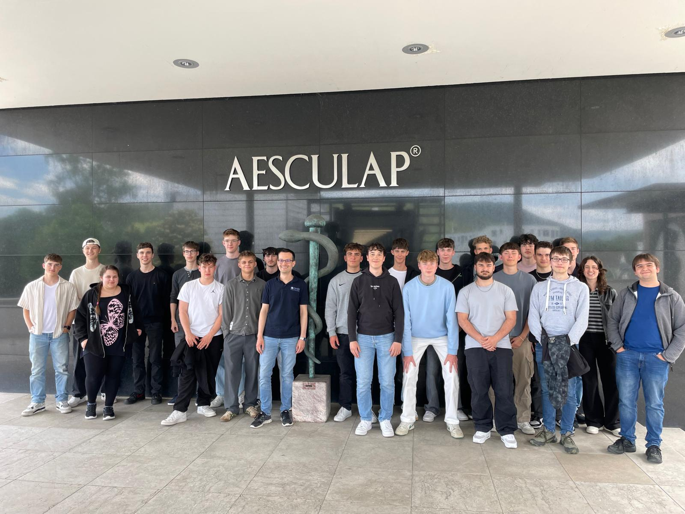

## Technisches Gymnasium Mechatronik auf Exkursion bei Hermle und Aesculap

Am 20. Mai 2025 besuchten die beiden Mechatronik-Klassen TGME11 und TGME12 des Technischen Gymnasiums die Unternehmen Hermle in Gosheim und Aesculap in Tuttlingen. Im Rahmen des Profilfaches Mechatronik, das unter anderem mit Werkstoffen und Fertigungstechnik beschäftigt, erhielten die Schülerinnen und Schüler praxisnahe Einblicke in die industrielle Fertigung und die Berufsmöglichkeiten in der Technik.

# Präzisionstechnik bei Hermle

Die Exkursion begann in Gosheim, wo die Schüler die Firma Hermle besuchten, die für ihre hochpräzisen CNC-Fräsmaschinen bekannt ist. Während der Führung durch das Unternehmen erhielten die Schülerinnen und Schüler faszinierende Einblicke in den Fertigungsprozess und die Endmontage der Maschinen. Besonders beeindruckend war die Präzision, mit der jede Maschine individuell nach den Anforderungen der Kunden gefertigt wird. Hermle bietet keine „Fräsmaschinen von der Stange“ an – jede Maschine ist eine maßgeschneiderte Lösung.

Das Unternehmen zeigte den Schülern, wie moderne Automatisierungstechnik, wie der Einsatz von Roboterzellen und automatischer Materialzufuhr, aus den einzelnen Maschinen komplexe Bearbeitungszentren macht. Gerade diese Interaktion von einzelnen Systemen ist der Kern des Profilfaches Mechatronik.

Neben der Vorstellung der Firma und ihrer Produkte wurde auch auf die vielfältigen Berufsmöglichkeiten bei Hermle eingegangen. Die Schüler konnten sich über verschiedene Karrierewege in der Industrie informieren und bekamen so einen wertvollen Einblick in ihre zukünftigen beruflichen Möglichkeiten. Der Besuch endete mit einer Einladung zum Mittagessen, was die herzliche und familiäre Atmosphäre des Unternehmens unterstrich.

## Instrumentenfertigung bei Aesculap

Nach dem Mittagessen ging es weiter zur Firma Aesculap, welche zum Konzern B.Braun und damit zu einem Weltmarktführer im Bereich Medizinprodukte zählt. In einer Führung durch die Instrumentenfertigung konnten die Schülerinnen und Schüler sehen, wie Fräsmaschinen in der Produktion von filigranen Bauteilen für die Medizintechnik eingesetzt werden. Zwei Auszubildende berichteten anschließend von den vielfältigen Ausbildungs- und Studienmöglichkeiten bei Aesculap, was den Schülerinnen und Schülern einen sinnvollen Einblick in mögliche berufliche Perspektiven gab.

## Austausch und Fazit

Die Exkursion bot den beiden Klassen nicht nur spannende Einblicke in zwei technologieführenden Unternehmen, sondern auch die Gelegenheit, sich auszutauschen. Die Schülerinnen und Schüler konnten so ihre theoretischen Kenntnisse aus dem Unterricht mit der Praxis verbinden und wertvolle Erfahrungen für ihre berufliche Orientierung sammeln.

„Kein Schulbuch ist in der Lage die heute gewonnen Einblicke in die Firmen zu ersetzen“, resümierte Simon Würstlin, einer der Lehrkräfte im Profilfach Mechatronik am technischen Gymnasium. Dank der Unterstützung von Herrn Müller (Hermle) und Frau Berger (Aesculap) konnten die Schülerinnen und Schüler einen einzigartigen Blick auf die Welt der Industrie werfen.
